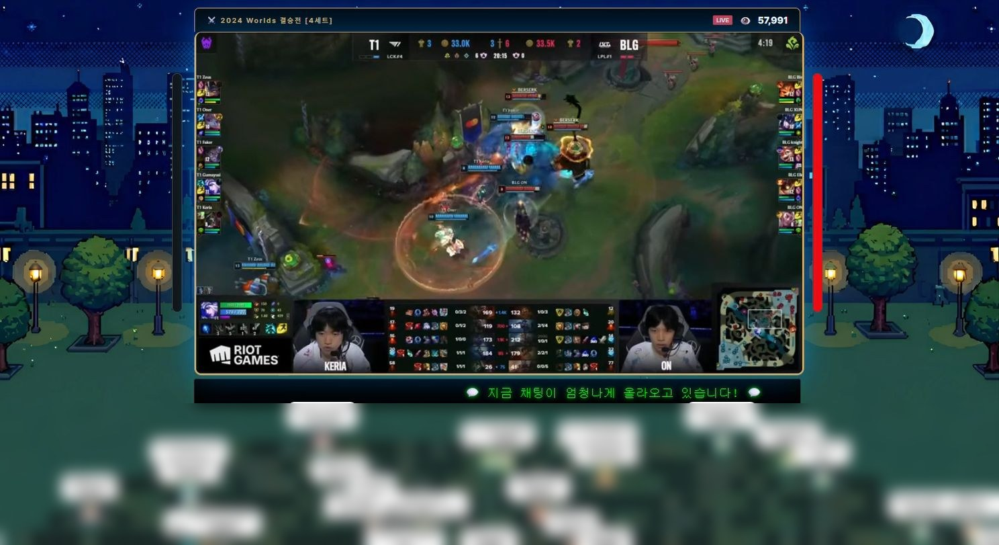
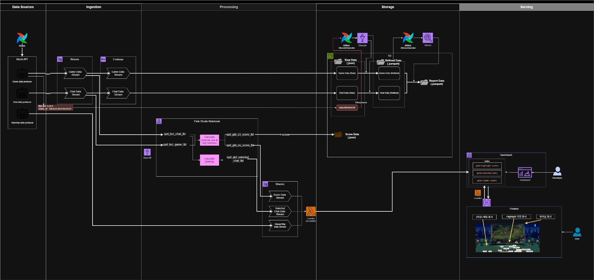
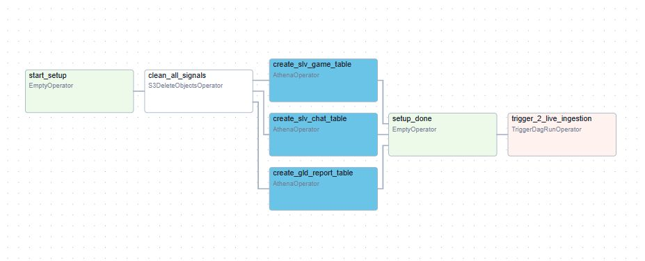
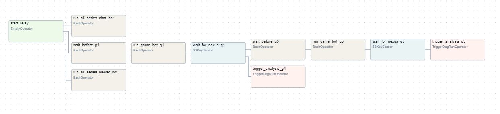
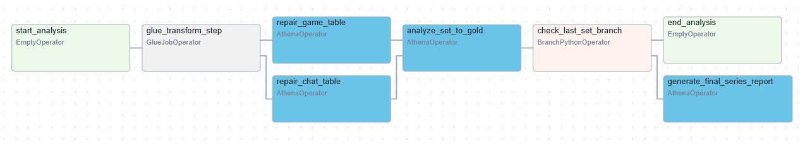
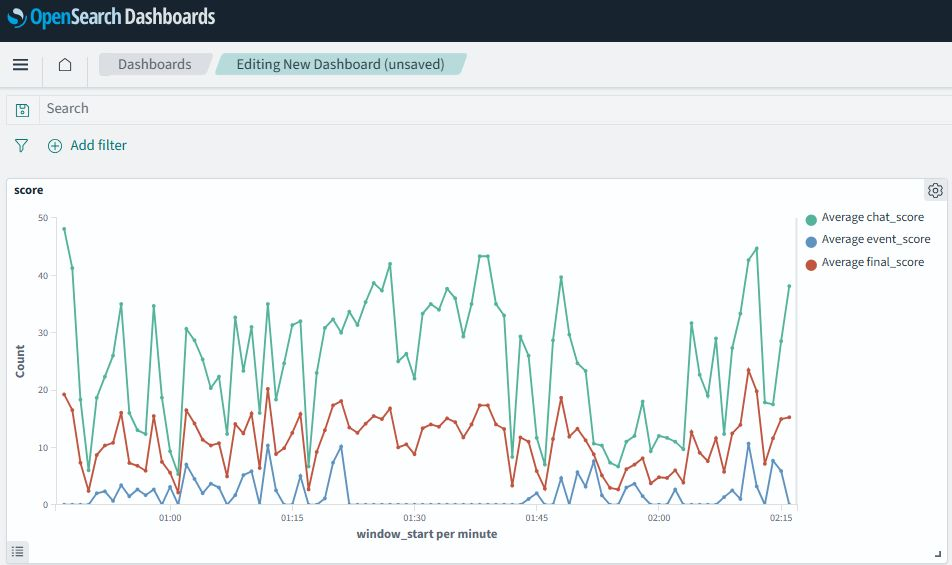

# LoL Realtime Highlight Pipeline

e스포츠 중계 스트림에서 **하이라이트 순간을 실시간으로 탐지**하는 데이터 파이프라인입니다.
2024 Worlds 결승전(T1 vs BLG) 4·5세트의 실제 경기 데이터와 라이브 채팅을 재생하여,
경기 지표와 시청자 반응을 결합한 하이라이트 점수를 산출하고 대시보드로 시각화합니다.

핵심 아이디어는 **경기 지표만으로는 하이라이트를 놓친다**는 관찰에서 출발합니다.
바론 스틸처럼 지표에 남는 순간뿐 아니라, 지표상 아무 일도 없지만 채팅이 폭증하는
슈퍼플레이 구간까지 잡아내기 위해 두 신호를 함께 사용합니다.



*채팅 급증 구간을 감지해 전광판에 표시하고, 시청자 수를 관중석 밀도로 시각화합니다.
말풍선 영역은 실제 시청자 닉네임이 포함되어 있어 블러 처리했습니다.*

---

## 아키텍처

Lambda Architecture를 적용해 **Speed Layer**(즉시 반응)와 **Batch Layer**(정확한 집계)를
분리했습니다.



다이어그램 원본(draw.io)은 [`docs/diagrams/`](docs/diagrams/)에 있습니다.

```
                        ┌──────────────────────────────────────────┐
                        │            Producers (Docker)            │
                        │   game_bot / chat_bot / viewer_bot       │
                        │   실제 경기 데이터를 원본 간격으로 재생   │
                        └────────────────┬─────────────────────────┘
                                         │
                            Kinesis Data Streams (Bronze)
                                         │
                    ┌────────────────────┴────────────────────┐
                    │                                         │
            [ Speed Layer ]                          [ Batch Layer ]
                    │                                         │
            Managed Flink                          Kinesis Data Firehose
         (실시간 점수 집계)                     (Dynamic Partitioning)
                    │                                         │
                    │                                  S3 Bronze (JSON)
                    │                                         │
                    │                                  Glue ETL Job
                    │                                (JSON → Parquet)
                    │                                         │
                    │                                 S3 Silver (Parquet)
                    │                                         │
                    │                                  Athena 집계 쿼리
                    │                                         │
                    │                                  S3 Gold (리포트)
                    │                                         │
                    └──────────────┬──────────────────────────┘
                                   │
                          OpenSearch / Lambda
                                   │
                        API Gateway → 대시보드
```

Batch Layer의 오케스트레이션은 **Airflow DAG 3개**로 구성됩니다.

| DAG | 역할 |
|---|---|
| [`1_live_infra_setup_dag`](airflow/dags/1_live_infra_setup_dag.py) | 이전 실행 시그널 정리, Athena 외부 테이블 생성 |
| [`2_live_ingestion_relay_dag`](airflow/dags/2_live_ingestion_relay_dag.py) | 세트별 프로듀서 기동, 종료 감지, 분석 DAG 트리거 |
| [`3_batch_analysis_dag`](airflow/dags/3_batch_analysis_dag.py) | Glue 변환 → 파티션 등록 → 세트 분석 → 시리즈 종합 |

**1. 인프라 초기화** — 이전 시그널을 정리하고 Athena 테이블을 준비한 뒤 수집 DAG를 트리거합니다.



**2. 수집 릴레이** — 세트별로 프로듀서를 기동하고, `S3KeySensor`가 종료 시그널을 감지하면
분석 DAG를 트리거한 뒤 다음 세트로 넘어갑니다. 4세트 분석과 5세트 수집이 겹쳐 진행됩니다.



**3. 배치 분석** — Glue 변환 후 파티션을 등록하고 세트 리포트를 만듭니다.
마지막 세트일 때만 분기하여 시리즈 종합 리포트를 생성합니다.



Speed Layer는 다음 구성요소로 이루어집니다.

| 구성요소 | 역할 |
|---|---|
| [`serving/flink/highlight_scoring.py`](serving/flink/highlight_scoring.py) | 슬라이딩 윈도우 기반 실시간 하이라이트 점수 산출 |
| [`serving/lambda/os_loader.py`](serving/lambda/os_loader.py) | Gold 스트림을 OpenSearch 인덱스로 라우팅·적재 |
| [`serving/lambda/api_handler.py`](serving/lambda/api_handler.py) | 대시보드 조회 API (GET /lol) |

산출된 점수는 OpenSearch에 적재되어 시계열로 확인할 수 있습니다.
채팅 점수(초록)가 이벤트 점수(파랑)보다 자주, 크게 튀는 것을 볼 수 있는데,
지표에 남지 않는 반응까지 포착하려는 설계 의도가 그대로 드러나는 부분입니다.



---

## 설계에서 고민한 부분

> 개별 결정의 배경·선택지·결과는 [docs/adr/](docs/adr/README.md) 에 ADR 53건으로 정리되어 있다. 아래는 그중 핵심 다섯 가지다.

### 1. 수집과 분석의 파이프라이닝

5세트 경기를 순차 처리하면 마지막 세트 분석이 끝날 때까지 전체가 대기합니다.
게임 봇이 넥서스 파괴를 감지하면 S3에 완료 시그널을 남기고, `S3KeySensor`가 이를
감지해 분석 DAG를 **비동기로 트리거**(`wait_for_completion=False`)한 뒤 곧바로 다음
세트 수집으로 넘어갑니다. 4세트를 분석하는 동안 5세트가 수집되므로 전체 소요 시간이
가장 느린 단일 세트 기준으로 수렴합니다.

### 2. 프로듀서 간 시간 동기화

세 프로듀서가 각자 `sleep`으로 간격을 유지하면 지연이 누적되어 타임라인이 어긋납니다.
Airflow의 논리적 실행 시각(`{{ ts }}`)을 **공통 기준점**으로 전달하고, 각 봇은
`기준 시각 + 원본 오프셋`으로 절대 발사 시각을 매번 다시 계산합니다. 지연이 누적되지
않아 세 스트림이 동일한 타임라인 위에서 동작합니다.

### 3. 파티션 등록 비용

`MSCK REPAIR TABLE`은 테이블 전체 경로를 스캔하므로 세트가 늘수록 비용이 증가합니다.
`ALTER TABLE ADD PARTITION`으로 해당 세트의 파티션만 등록하여 세트 수와 무관하게
일정한 비용을 유지했습니다.

### 4. 슬라이딩 윈도우와 하이라이트 경계

텀블링 윈도우를 쓰면 하이라이트가 윈도우 경계에 걸칠 때 점수가 두 구간으로
쪼개져 정점이 낮아집니다. `HOP` 슬라이딩 윈도우로 5초 구간을 2초마다 겹쳐
계산해 정점을 안정적으로 포착했습니다.

또한 채팅이 없는 구간에서는 워터마크가 진행되지 않아 윈도우가 닫히지 않는
문제가 있었습니다. 게임 프레임을 점수 0짜리 하트비트 레코드로 함께 흘려보내
시간이 계속 진행되도록 했습니다.

### 5. 스키마 타입 충돌

`victim_id`에 챔피언 ID(정수)와 `NEXUS DESTROYED`(문자열)가 혼재해 Glue 스키마 추론 시
파티션별로 타입이 달라지는 문제가 있었습니다. 프로듀서 단계에서 문자열로 통일해
Silver 레이어의 스키마 일관성을 확보했습니다.

---

## 발전 과정

로컬 배치로 시작해 실시간 처리로 확장했습니다. 각 단계의 코드는 커밋 이력에 남아 있습니다.

| 단계 | 구성 | 한계와 다음 과제 |
|---|---|---|
| v0.1 | Airflow + PostgreSQL, 더미 데이터 적재 | 파이프라인 형태만 검증. 실제 데이터가 없음 |
| v0.2 | 경기 지표와 채팅을 결합한 하이브리드 하이라이트 판정 | 단일 DB에 의존해 확장이 어려움 |
| v0.3 | 실제 경기·채팅 데이터 수집 및 프로듀서 도입 | 배치 처리만 가능해 실시간 반응이 없음 |
| v1.0 | AWS 스트리밍 전환, Speed / Batch Layer 분리 | 인프라가 수동 구성 상태 (IaC 전환 예정) |

---

## 실행 방법

### 사전 준비

- Docker / Docker Compose
- AWS 계정 및 CLI 자격 증명 (Kinesis, S3, Glue, Athena 권한)

### 1. 환경 변수 설정

```bash
cp .env.example .env
# .env를 열어 AWS 자격 증명과 Airflow 계정 정보를 입력합니다.
```

### 2. AWS 리소스 구성

Kinesis, Firehose, Glue, Athena, OpenSearch, Lambda, API Gateway를 관리 콘솔에서
구성합니다. 필요한 설정값과 순서는 [`docs/aws-setup.md`](docs/aws-setup.md)에
정리되어 있습니다.

생성한 리소스 이름과 API Gateway 호출 URL을
[`config/config.yaml`](config/config.yaml)에 반영합니다.

### 3. 스택 기동

```bash
docker compose up -d --build
```

- Airflow UI: http://localhost:8080
- 대시보드: http://localhost

### 4. 파이프라인 실행

Airflow UI에서 `1_live_infra_setup_dag`를 실행하면 이후 DAG가 순차적으로 연결됩니다.

자주 사용하는 명령은 [`config/command.MD`](config/command.MD)를 참고하세요.

---

## 프로젝트 구조

```
├── airflow/dags/          # 배치 오케스트레이션 DAG 및 Athena SQL
│   └── sql/               # DDL 및 집계 쿼리
├── data_source/
│   ├── api_server/        # FastAPI 수집 엔드포인트
│   └── producer/          # 게임 / 채팅 / 시청자 프로듀서
├── glue_jobs/             # Bronze → Silver 변환 Spark 스크립트
├── serving/               # Speed Layer
│   ├── flink/             # 실시간 하이라이트 점수 산출 (PyFlink)
│   ├── lambda/            # OpenSearch 적재 / 조회 API
│   └── opensearch/        # 인덱스 템플릿
├── frontend/              # 실시간 대시보드 (정적)
├── scripts/               # 데이터 수집 및 전처리 유틸리티
├── docs/                  # AWS 구성 가이드, 아키텍처 다이어그램, 실행 화면
└── config/config.yaml     # 리소스 이름 및 시뮬레이션 설정
```

---

## 데이터 및 개인정보 처리

`data_source/producer/chat/data/t1_blg_chat.jsonl`은 공개 방송의 라이브 채팅을 수집한
데이터입니다. 시청자 닉네임이 포함되므로 **원본은 저장소에 포함하지 않으며**,
[`scripts/anonymize_chat.py`](scripts/anonymize_chat.py)로 다음 처리를 거친 샘플만 커밋합니다.

- 닉네임을 salt 기반 SHA-256으로 해싱하여 `viewer_xxxxxxxx`로 치환 (역산 불가)
- 메시지 본문의 `@멘션`도 동일 규칙으로 치환
- 동일 닉네임은 동일 값으로 매핑되어 사용자 단위 집계 검증은 그대로 가능
- 전체 구간에서 균등 추출하여 채팅 밀도의 시간 분포를 보존

```bash
python scripts/anonymize_chat.py \
    --input  <원본.jsonl> \
    --output data_source/producer/chat/data/t1_blg_chat.jsonl \
    --salt   "$CHAT_ANON_SALT" \
    --sample 2000
```

---

## 기술 스택

| 영역 | 기술 |
|---|---|
| 오케스트레이션 | Apache Airflow 2.10 |
| 스트리밍 | Kinesis Data Streams, Kinesis Data Firehose, Managed Flink |
| 저장 | S3 (Bronze / Silver / Gold), OpenSearch |
| 처리 | AWS Glue (PySpark), Amazon Athena |
| 서빙 | Lambda, API Gateway |
| 실행 환경 | Docker Compose |
| 애플리케이션 | FastAPI, Nginx, Vanilla JS |

> AWS 리소스는 관리 콘솔에서 수동 구성했으며, 설정값을
> [`docs/aws-setup.md`](docs/aws-setup.md)에 기록했습니다.
> IaC(CDK/Terraform) 전환은 향후 개선 과제입니다.
